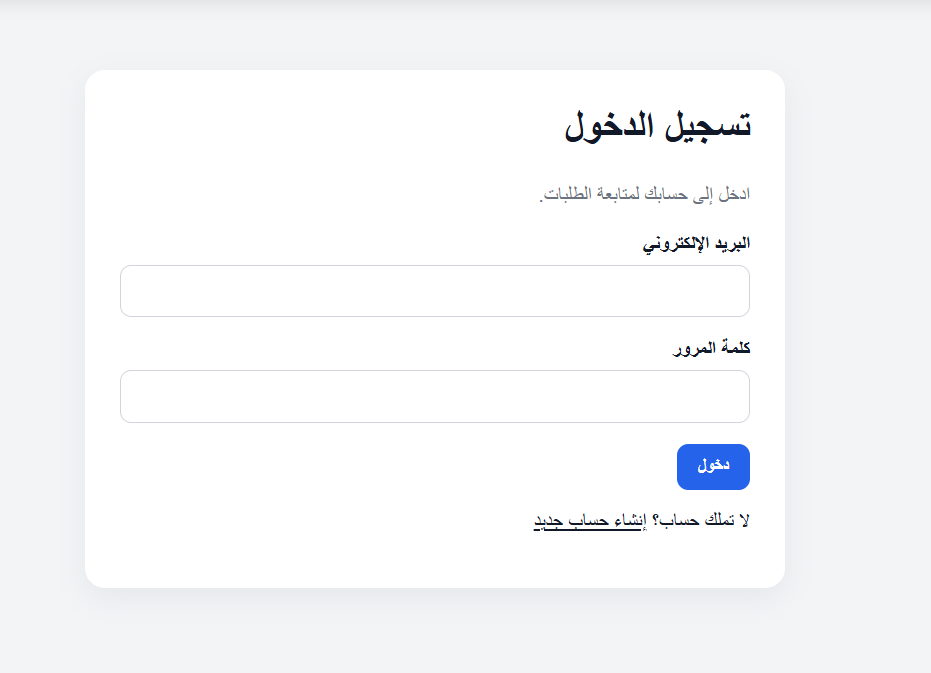
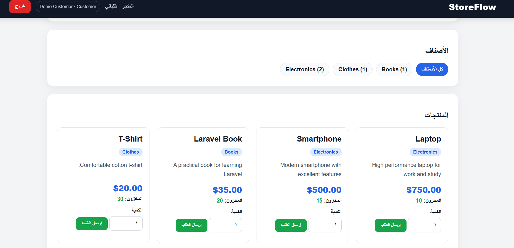
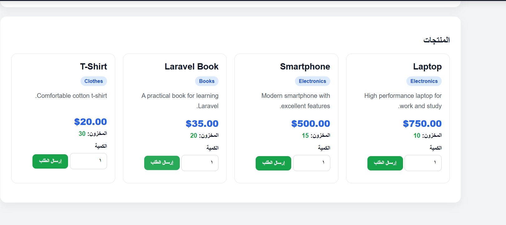
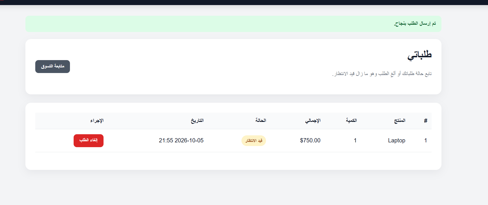

# StoreFlow

**StoreFlow** is a Laravel 12 portfolio application for product catalog, inventory, customer orders, and admin operations. It demonstrates authentication, role-based access control, transactional order handling, stock consistency, soft deletes, server-side validation, automated tests, and CI.

The UI is Arabic-first (RTL), while the codebase follows standard Laravel conventions.

## Highlights

- Customer registration, login, logout, and session regeneration
- `admin` and `user` roles with admin middleware protection
- Public product catalog with category filtering and search
- Category management for administrators
- Product management with prices and inventory quantities
- Soft-delete product archive with restore support
- Customer order history and pending-order cancellation
- Admin order workflow: `pending → approved → completed` or rejection
- Automatic stock restoration after customer cancellation or admin rejection
- Database transactions and `lockForUpdate()` around inventory-sensitive operations
- Order history preserved when products are archived
- Login and registration throttling
- Form Request validation
- Feature tests using SQLite in-memory database
- GitHub Actions test workflow and Dependabot configuration

## Tech Stack

- PHP 8.2+
- Laravel 12
- Eloquent ORM
- SQLite by default; MySQL/PostgreSQL can also be configured
- Blade templates
- PHPUnit 11
- Vite / Tailwind dependencies available for future frontend expansion

## Application Roles

### Customer

Customers can browse the store, register or log in, place orders, view their own order history, and cancel an order while it is still pending.

### Admin

Admins can access the management dashboard, manage categories and products, restore archived products, review all orders, and move orders through the allowed status workflow.

## Order & Inventory Safety

Order creation is executed inside a database transaction. The product row is locked before availability is checked and inventory is decremented. This reduces overselling risk when multiple requests target the same product concurrently.

Cancellation and rejection also run inside transactions. Inventory is restored exactly when an order leaves the active workflow through cancellation or rejection.

Allowed admin transitions:

```text
pending  ──> approved ──> completed
   │            │
   └──> rejected <──────┘
```

Customers may change `pending` to `cancelled` only for their own orders.

## Local Setup

### Requirements

- PHP 8.2+
- Composer 2
- SQLite extension enabled, or another Laravel-supported database

### Install

```bash
git clone https://github.com/m7mdkh2003/store_finalproj.git
cd store_finalproj
composer install
cp .env.example .env
php artisan key:generate
php artisan migrate:fresh --seed
php artisan serve
```

Then open `http://127.0.0.1:8000`.

The default `.env.example` uses SQLite. If `database/database.sqlite` does not exist, create it before migrating:

**macOS / Linux**

```bash
touch database/database.sqlite
```

**Windows PowerShell**

```powershell
New-Item database/database.sqlite -ItemType File
```

On Windows, use `Copy-Item .env.example .env` instead of `cp .env.example .env` if needed.

### MySQL Example

Update `.env`:

```env
DB_CONNECTION=mysql
DB_HOST=127.0.0.1
DB_PORT=3306
DB_DATABASE=storeflow
DB_USERNAME=root
DB_PASSWORD=
```

Then run:

```bash
php artisan migrate:fresh --seed
```

## Demo Accounts

After running the database seeder:

| Role | Email | Password |
|---|---|---|
| Admin | `admin@example.com` | `Admin12345` |
| Customer | `customer@example.com` | `Customer12345` |

These credentials are **development/demo credentials only**. Do not reuse them in production.

## Testing

Run the feature test suite:

```bash
php artisan test
```

The included tests cover:

- regular-user registration
- admin authorization
- product/category management
- soft deletion
- successful order placement
- stock validation
- customer cancellation and stock restoration
- admin rejection and stock restoration

GitHub Actions runs the test suite on pushes to `main`/`master` and on pull requests.

## Project Structure

```text
app/
├── Http/
│   ├── Controllers/
│   ├── Middleware/EnsureUserIsAdmin.php
│   └── Requests/
├── Models/
└── Services/OrderService.php

database/
├── factories/
├── migrations/
└── seeders/

resources/views/
├── auth/
├── categories/
├── orders/
├── products/
└── layouts/

tests/Feature/
```

## Architecture Notes

`OrderService` owns inventory-sensitive business logic rather than placing that logic directly in HTTP controllers. Controllers remain responsible for request/response flow, Form Requests own validation, middleware owns role access, and Eloquent models own relationships and status helpers.

Products use soft deletes so removing an item from the active catalog does not destroy historical order references. The archive screen lets an administrator restore a product later.

## Security Measures Included

- Laravel CSRF protection on state-changing forms
- hashed password cast
- session regeneration after authentication
- role-based admin middleware
- request validation
- throttled login and registration endpoints
- database-bound query parameters through Eloquent
- no `.env` secrets committed to the repository

For a production deployment, also configure HTTPS, secure session/cookie settings, production mail, backups, monitoring, and environment-specific secrets.
## Screenshots

### Login


### Dashboard


### Products


### Orders

## License

MIT License. See [LICENSE](LICENSE).
